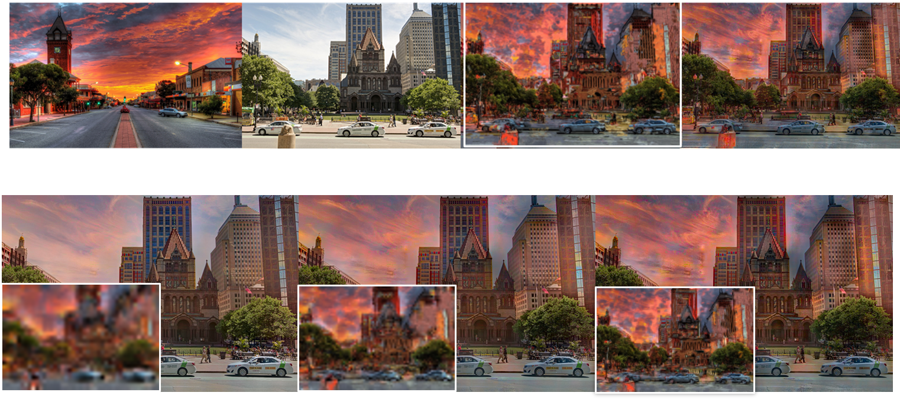

# ProgressiveColorTransfer_Pytorch
CSCI5210 Project | Pytorch Re-Implementation: Progressive Color Transfer with Dense Semantic Correspondences (SIGGRAPH 2019)

It is just a non-official course project implementation, offcial C++ implementation is [here](https://github.com/hmmlillian/Neural-Color-Transfer).

```bash
export PYTHONPATH=/path/to/the/project/ProgressiveColorTransfer_Pytorch:$PYTHONPATH
cd ProgressiveColorTransfer_Pytorch
bash exps/00-baseline/inference.sh
```
## Results

## Notes

The patchmatch is superslow since it was a GPU version. You can get intermediate results by reduce the number of feature extraction layers in the configuration file. Some details may different with the original paper, so I just find out a workable setting through experiments.

I did not implement the non-local loss term.

Thanks for the code of [Deep Image Analogy PyTorch](https://github.com/harveyslash/Deep-Image-Analogy-PyTorch) and [Neural Color Transfer PyTorch Implementation](https://github.com/rassilon712/Neural_Color_Transfer).

